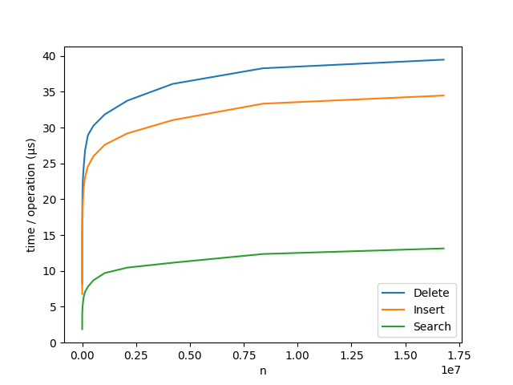
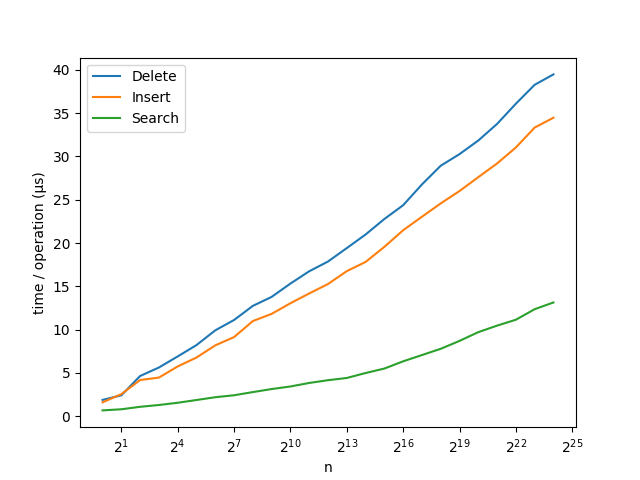

| Note: pyvl-tree is an educational project with the goal of being an easy-to-read reference for someone wanting to understand or implement an AVL tree. If you're looking for something to use in production, you should consider using something faster and more robust like [sortedcontainers](https://github.com/grantjenks/python-sortedcontainers). |
| --- |

# pyvl-tree

_pyvl-tree_ is an a self-balancing binary search tree (BST) implemented using the Adelson-Velsky & Landis, _AVL_, algorithms.

A self-balancing BST has the valuable property that its height is at most _log<sub>2</sub>(n)_, 
where _n_ is the number of elements in the tree. This means that __search__, __insertion__ and __deletion__ 
has more reliable performance than an ordinary BST as the number of elements in the tree increases.

## Install
Install with,

```
pip install pyvl-tree
```

## API

### `class pyvltree.AVLTree`
A recursive implementation of a self-balancing binary search tree. Self-balancing is achieved using the AVL algorithms.

#### `AVLTree()`
Constructor. Creates a AVLTree object and returns it.

#### `search(key)`
Search for an element given an equivalent key.

Equivalence is determined based on the elements __eq__ method.

Time complexity: O(log n)

Returns the element equivalent to the key if found, None otherwise.

#### `size()`
Returns the number of elements in the tree.

Time complexity: O(1)

#### `insert(obj)`
Insert an element into the tree.

Duplicate elements will be silently discarded.

Time complexity: O(log n)

#### `delete(obj)`
Deletes an element from the tree.

Time complexity: O(log n)

## Performance
### Linear scale


### Logarithmic scale

